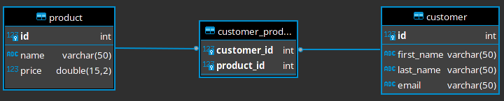
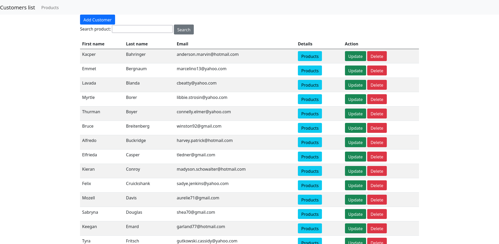
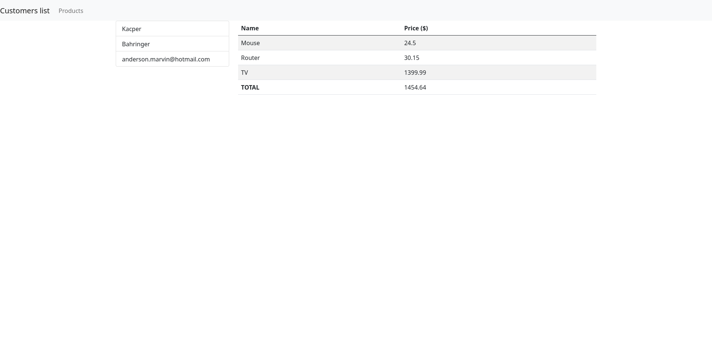
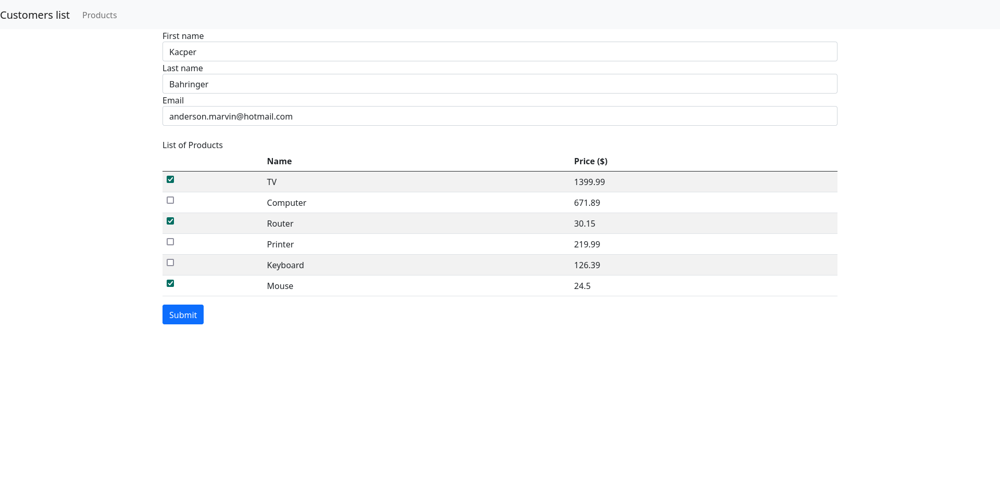
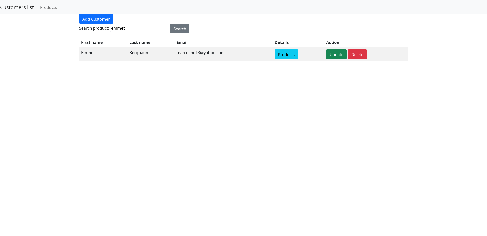
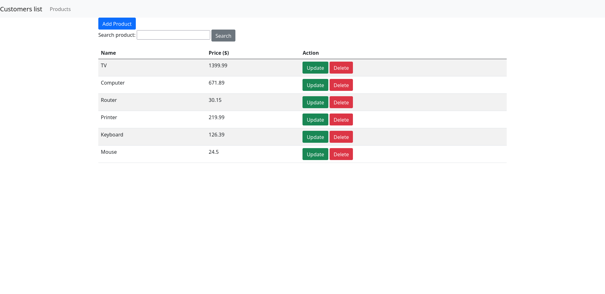

# Web-Customer-Manager

## About

Web-Customer-Manager is a simple application that uses Spring MVC and 
CRUD functionalities. The project demonstrates the use of a database, 
Spring MVC and Hibernate.

The project was implemented to educate.

## Informations

- `Java 11`
- `Spring 5.3.9`
- `Hibernate 5.5.7`
- `MySQL` database server on `docker`
- `Tomcat 9.0.43`  

## Database structure

Database contains 3 tables:

- customer
- product
- customer_product

## Sample screenshots

### Customer

#### Customer list

#### Customer products

#### Customer update-crate

#### Customer search by text

### Product

Product has the same functionalities as the Customer.

#### Product list

